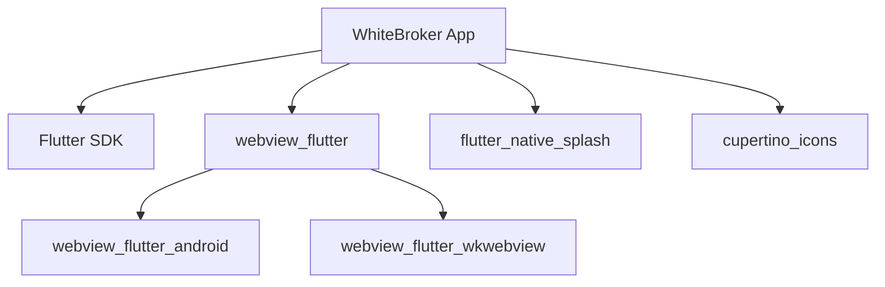

# 📊 Структура проекта WhiteBroker App

```
whitebroker_app/
│
├── 📱 Основное приложение
│   ├── lib/
│   │   └── main.dart                    ⭐ Главный файл приложения
│   ├── assets/
│   │   └── splash_icon.svg              🎨 Иконка для splash screen
│   └── pubspec.yaml                     📦 Конфигурация и зависимости
│
├── 🤖 Android конфигурация
│   └── android/
│       ├── app/
│       │   ├── build.gradle.kts         ⚙️ Gradle конфигурация
│       │   └── src/main/
│       │       ├── AndroidManifest.xml  ⚠️ HTTP настройки
│       │       ├── kotlin/              💻 MainActivity
│       │       └── res/                 🎨 Ресурсы и splash
│       └── gradle/                      🔧 Gradle wrapper
│
├── 🍎 iOS конфигурация
│   └── ios/
│       ├── Runner/
│       │   ├── Info.plist               ⚠️ HTTP настройки
│       │   ├── AppDelegate.swift        💻 Главный делегат
│       │   └── Assets.xcassets/         🎨 Ресурсы приложения
│       └── Runner.xcodeproj/            🔧 Xcode проект
│
├── 🖥️ Другие платформы
│   ├── web/                             🌐 Web версия
│   ├── windows/                         🪟 Windows
│   ├── macos/                           🍎 macOS
│   └── linux/                           🐧 Linux
│
├── 📚 Документация
│   ├── README.md                        📖 Полная документация
│   ├── QUICKSTART.md                    ⚡ Быстрый старт
│   ├── ABOUT.md                         📝 Подробное описание
│   ├── PROJECT_COMPLETE.md              🎉 Итоги проекта
│   └── PROJECT_STRUCTURE.md             📊 Этот файл
│
└── 🧪 Тесты
    └── test/
        └── widget_test.dart             🧪 Тесты виджетов
```

## 🔑 Ключевые файлы

### 1. `lib/main.dart` (105 строк)
**Назначение:** Основная логика приложения
**Содержит:**
- Конфигурация приложения
- WebView контроллер
- Обработка splash screen
- UI компоненты

**Основные классы:**
- `MyApp` - Главный виджет приложения
- `WebViewPage` - Страница с WebView
- `_WebViewPageState` - Состояние WebView

### 2. `android/app/src/main/AndroidManifest.xml` (50 строк)
**Назначение:** Настройки Android приложения
**Ключевые параметры:**
- ✅ `android:usesCleartextTraffic="true"` - HTTP без SSL
- ✅ `INTERNET` permission - Доступ к интернету
- ✅ `ACCESS_NETWORK_STATE` - Статус сети

### 3. `ios/Runner/Info.plist` (69 строк)
**Назначение:** Настройки iOS приложения
**Ключевые параметры:**
- ✅ `NSAppTransportSecurity` - Безопасность транспорта
- ✅ `NSAllowsArbitraryLoads` - Разрешить HTTP
- ✅ `NSExceptionDomains` - Исключения для доменов

### 4. `pubspec.yaml` (90 строк)
**Назначение:** Конфигурация проекта и зависимости
**Зависимости:**
- `webview_flutter: ^4.4.2` - WebView компонент
- `flutter_native_splash: ^2.3.5` - Splash screen
- `cupertino_icons: ^1.0.8` - iOS иконки

**Конфигурация splash:**
```yaml
flutter_native_splash:
  color: "#2563EB"
  color_dark: "#1E40AF"
  android: true
  ios: true
```

## 📦 Зависимости проекта



## 🔄 Поток данных

```
1. Запуск приложения
   ↓
2. Показ Splash Screen (синий фон)
   ↓
3. Инициализация WebView
   ↓
4. Загрузка http://89.104.65.16/login
   ↓
5. Показ индикатора загрузки
   ↓
6. Страница загружена
   ↓
7. Скрытие Splash Screen
   ↓
8. Показ WebView с сайтом
```

## 🎨 UI Компоненты

```
┌──────────────────────────────────┐
│ AppBar                            │
│  "WhiteBroker"          [↻]      │
├──────────────────────────────────┤
│                                   │
│                                   │
│        WebView Content            │
│    (http://89.104.65.16/login)   │
│                                   │
│        или                        │
│                                   │
│      [CircularProgress]           │
│      (при загрузке)               │
│                                   │
│                                   │
└──────────────────────────────────┘
```

## 🔐 Безопасность

### Android Security
```xml
<application
    android:usesCleartextTraffic="true">  <!-- HTTP разрешен -->
    ...
</application>

<uses-permission android:name="android.permission.INTERNET" />
```

### iOS Security
```xml
<key>NSAppTransportSecurity</key>
<dict>
    <key>NSAllowsArbitraryLoads</key>
    <true/>  <!-- HTTP разрешен -->
    <key>NSExceptionDomains</key>
    <dict>
        <key>89.104.65.16</key>  <!-- Наш домен -->
        ...
    </dict>
</dict>
```

## 📱 Платформы

| Платформа | Поддержка | Примечания |
|-----------|-----------|------------|
| 🤖 Android | ✅ Полная | API 21+ (Android 5.0+) |
| 🍎 iOS | ✅ Полная | iOS 12.0+ |
| 🌐 Web | ⚠️ Частичная | WebView не нужен в браузере |
| 🪟 Windows | ⚠️ Базовая | Требует webview_windows |
| 🍎 macOS | ⚠️ Базовая | Требует webview_macos |
| 🐧 Linux | ⚠️ Базовая | Требует webview_linux |

## 🎯 Возможности

### ✅ Реализовано
- [x] WebView с HTTP поддержкой
- [x] Splash screen с автоматическим скрытием
- [x] Индикатор загрузки
- [x] Кнопка обновления
- [x] Обработка ошибок
- [x] Android настройки
- [x] iOS настройки
- [x] Документация

### 🔮 Можно добавить
- [ ] Навигация (назад/вперед)
- [ ] Сохранение cookies
- [ ] Pull-to-refresh
- [ ] Кэширование
- [ ] Deep links
- [ ] Push-уведомления
- [ ] Файловый менеджер
- [ ] Темная/светлая тема

## 📏 Размеры

| Компонент | Размер |
|-----------|--------|
| Основной код (main.dart) | ~3 KB |
| Android APK (release) | ~15-20 MB |
| iOS IPA (release) | ~20-25 MB |
| Исходный код | ~50 KB |
| Документация | ~30 KB |

## 🔧 Инструменты разработки

- **IDE:** Android Studio / VS Code / IntelliJ IDEA
- **Flutter SDK:** 3.8.1+
- **Dart SDK:** Включен в Flutter
- **Gradle:** 8.0+
- **Android SDK:** API 21+
- **Xcode:** 14.0+ (для iOS)

## 📚 Дополнительные ресурсы

### Документация проекта:
- 📖 [README.md](README.md) - Полная документация
- ⚡ [QUICKSTART.md](QUICKSTART.md) - Быстрый старт
- 📝 [ABOUT.md](ABOUT.md) - Описание реализации
- 🎉 [PROJECT_COMPLETE.md](PROJECT_COMPLETE.md) - Итоги

### Официальная документация:
- [Flutter](https://flutter.dev/docs)
- [WebView Flutter](https://pub.dev/packages/webview_flutter)
- [Flutter Native Splash](https://pub.dev/packages/flutter_native_splash)

---

**Обновлено:** 29 октября 2025  
**Версия структуры:** 1.0

